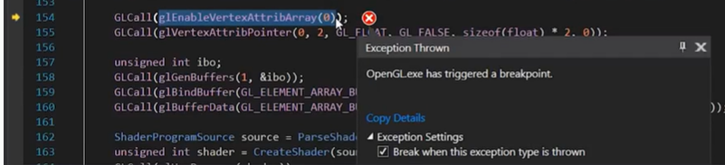

## 为什么要有顶点数组
在之前的案例当中，`positions`和`indices`都是硬编码写死的。但是在实际应用当中，两者可能都会改变，而且不仅是数值会改变，可能还有其他顶点属性，如顶点法向量、顶点颜色等等。

在下面的代码中，我们假设顶点缓冲区会变化，看一下，我们需要做哪些操作。

```cpp
//...

int main(void)
{
    //...
    float positions[] =
    {                  //索引号
        -0.5f, -0.5f,  //0，从0开始
         0.5f, -0.5f,  //1
         0.5f,  0.5f,  //2
        -0.5f,  0.5f   //3
    };

    unsigned int indices[] =
    {
        0, 1, 2, //第1个三角形
        2, 3, 0  //第2个三角形
    };

    //创建一个缓冲区
    unsigned int buffer;
    GLCall(glGenBuffers(1, &buffer));
    //为GL_ARRAY_BUFFER类型绑定一个缓冲区
    GLCall(glBindBuffer(GL_ARRAY_BUFFER, buffer));
    //将数据拷贝到GL_ARRAY_BUFFER类型的缓冲区上
    GLCall(glBufferData(GL_ARRAY_BUFFER, 4 * 2 * sizeof(float), positions, GL_STATIC_DRAW));

    //指定顶点缓冲区的布局
    GLCall(glEnableVertexAttribArray(0));
    GLCall(glVertexAttribPointer(0, 2, GL_FLOAT, GL_FALSE, 2 * sizeof(float), 0));

    //创一个缓冲区
    unsigned int ibo;
    GLCall(glGenBuffers(1, &ibo));
    //为GL_ELEMENT_ARRAY_BUFFER类型绑定一个缓冲区
    GLCall(glBindBuffer(GL_ELEMENT_ARRAY_BUFFER, ibo));
    //将数据拷贝到GL_ELEMENT_ARRAY_BUFFER类型的缓冲区上
    GLCall(glBufferData(GL_ELEMENT_ARRAY_BUFFER, 6 * sizeof(unsigned int), indices, GL_STATIC_DRAW));

    //着色器
    ShaderProgramSource source = ParseShader("res/shaders/Basic.shader");
    unsigned int shader = CreateShader(source.VertexSource, source.FragmentSource);
    GLCall(glUseProgram(shader));

    //获取变量的句柄
    int location;
    GLCall(location = glGetUniformLocation(shader, "u_Color"));
    ASSERT(location != -1);

    //在创建完顶点缓冲区与索引缓冲区后，要进行解绑。因为在下一个流程当中，可能会创建别的缓冲区
    GLCall(glUseProgram(0));                            //解绑着色器
    GLCall(glBindBuffer(GL_ARRAY_BUFFER, 0));           //解绑顶点缓冲区
    GLCall(glBindBuffer(GL_ELEMENT_ARRAY_BUFFER, 0));   //解绑索引缓冲区

    float r = 0.0f;
    float increment = 0.05f;

    while (!glfwWindowShouldClose(window))
    {
        GLCall(glClear(GL_COLOR_BUFFER_BIT));

        //在绘制前，才决定要使用哪个着色器、哪个顶点缓冲区和哪个索引缓冲区
        //着色器
        GLCall(glUseProgram(shader));                            
        //顶点缓冲区
        GLCall(glBindBuffer(GL_ARRAY_BUFFER, buffer));
        GLCall(glEnableVertexAttribArray(0));   //如果前面disalbeVertexAttribArray的，这里需要Enable
        GLCall(glVertexAttribPointer(0, 2, GL_FLOAT, GL_FALSE, 2 * sizeof(float), 0)); //这里还需要告诉OpenGL顶点缓冲区的内存布局
        //索引缓冲区
        GLCall(glBindBuffer(GL_ELEMENT_ARRAY_BUFFER, ibo));

        GLCall(glUniform4f(location, r, 0.3f, 0.8f, 1.0f)); //传值

        GLCall(glDrawElements(GL_TRIANGLES, 6, GL_UNSIGNED_INT, nullptr));

        if (r > 1.0f)      increment = -0.05f;
        else if (r < 0.0f) increment = 0.05f;

        r += increment;

        glfwSwapBuffers(window);

        glfwPollEvents();
    }

    GLCall(glDeleteProgram(shader));

    glfwTerminate();
    return 0;
}
```

为什么在绘制时，又要指定一次顶点缓冲区的布局？

- 因为`glVertexAttribPointer`是作用于OpenGL当前的`GL_ARRAY_BUFFER`，而并没有存储到`buffer`所指向的缓冲区上
- 因此，在绘制的时候，在我们重新绑定一个顶点缓冲区后，我们又要调用`glVertexAttribPointer`，去解释此时绑定的顶点缓冲区的布局是怎么样的

“顶点数组”能够记录顶点缓冲区的状态。简而言之，一个顶点数组会记录

1. 此顶点数组的缓冲区是哪个
2. 此缓冲区的内存布局是怎么样的

因此，如果你使用的顶点数组，在绘制时，由原先的两大步，简化成了一步。


## 顶点数组
顶点数组

- 基本上是一种通过特定规范，绑定顶点缓冲区的方式
- “顶点数组”是OpenGL的特产，DirectX等其他渲染接口中并不存在这个概念

因此，如果我们正确使用顶点数组对象，不仅写代码方便，性能还会得到提升。  
例如，为几何体的每个部分创建不同的顶点数组对象，在切换几何体时，我们只需绑定其对应的顶点数组对象即可。

### 顶点数组是必须的
#### 兼容性配置文件
从技术上讲，顶点数组对象是必须的。虽然在之前的代码中，我们都没有创建它。
这是因为，OpenGL默认使用的是“兼容性配置文件”，它会帮我们创建并维护一个默认的顶点数组。

```cpp
//希望OpenGL的版本是3.3
glfwWindowHint(GLFW_CONTEXT_VERSION_MAJOR, 3);
glfwWindowHint(GLFW_CONTEXT_VERSION_MINOR, 3);
//使用“兼容性配置文件”（默认就是这个）
glfwWindowHint(GLFW_OPENGL_PROFILE, GLFW_OPENGL_COMPAT_PROFILE);
```

#### 核心配置文件

然而，“核心配置文件”却没有这个策略，“核心配置文件”不会帮我们创建这个默认的顶点数组。

```cpp
//希望OpenGL的版本是3.3
glfwWindowHint(GLFW_CONTEXT_VERSION_MAJOR, 3);
glfwWindowHint(GLFW_CONTEXT_VERSION_MINOR, 3);
//使用“核心配置文件”
glfwWindowHint(GLFW_OPENGL_PROFILE, GLFW_OPENGL_CORE_PROFILE);
```

因此，如果我们在前面加上了使用“核心配置文件”的代码，那么就会编译出错。错误码1282，




总之，若是“核心配置文件”，我们就需要显式地创建OpenGL顶点数组对象。在绑定顶点缓冲区前，创建顶点数组对象即可，例如：
```cpp
//创建一个顶点数组
unsigned int vao;
GLCall(glGenVertexArrays(1, &vao));
//绑定顶点数组（之后绑定顶点缓冲区、指定顶点缓冲区布局的操作，都会记录在vao上）
GLCall(glBindVertexArray(vao));

unsigned int buffer;
GLCall(glGenBuffers(1, &buffer));
GLCall(glBindBuffer(GL_ARRAY_BUFFER, buffer));
//...
```

### 使用顶点数组
```cpp
//...

int main(void)
{
    //...
    float positions[] =
    {                  //索引号
        -0.5f, -0.5f,  //0，从0开始
         0.5f, -0.5f,  //1
         0.5f,  0.5f,  //2
        -0.5f,  0.5f   //3
    };

    unsigned int indices[] =
    {
        0, 1, 2, //第1个三角形
        2, 3, 0  //第2个三角形
    };

    //创建一个顶点数组
    unsigned int vao;
    GLCall(glGenVertexArrays(1, &vao));
    //绑定顶点数组（之后绑定顶点缓冲区、指定顶点缓冲区布局的操作，都会记录在vao上）
    GLCall(glBindVertexArray(vao));

    //绑定顶点缓冲区
    unsigned int buffer;
    GLCall(glGenBuffers(1, &buffer));
    GLCall(glBindBuffer(GL_ARRAY_BUFFER, buffer));
    GLCall(glBufferData(GL_ARRAY_BUFFER, 4 * 2 * sizeof(float), positions, GL_STATIC_DRAW));
    //解释顶点缓冲区的布局
    GLCall(glEnableVertexAttribArray(0));
    GLCall(glVertexAttribPointer(0, 2, GL_FLOAT, GL_FALSE, 2 * sizeof(float), 0));

    //...

    /* 解绑 */
    GLCall(glBindVertexArray(0));
    GLCall(glBindBuffer(GL_ARRAY_BUFFER, 0));
    GLCall(glBindBuffer(GL_ELEMENT_ARRAY_BUFFER, 0));

    while (!glfwWindowShouldClose(window))
    {
        //...
        //只需绑定顶点数组对象
        GLCall(glBindVertexArray(vao));
        //无需再做这两个操作
        //1. 绑定顶点缓冲区
        //GLCall(glBindBuffer(GL_ARRAY_BUFFER, buffer));
        //2. 指定顶点缓冲区的布局
        //GLCall(glEnableVertexAttribArray(0));
        //GLCall(glVertexAttribPointer(0, 2, GL_FLOAT, GL_FALSE, 2 * sizeof(float), 0));

        //...
    }

    GLCall(glDeleteProgram(shader));

    glfwTerminate();
    return 0;
}
```

### 1个顶点数组对象，还是N个
当前的代码中，只是一个HelloWorld。

在实际工程应用当中，哪种策略更优呢？

1. 全局始终只绑定一个顶点数组对象。当绘制某个网格时，再绑定顶点缓冲数组与解释布局
2. 一个网格一个顶点数组对象。当绘制某个网格时，绑定网格对应的顶点数组对象即可

答案是视情况而定

- 需要在你的生产环境中做测试才能确定，
- 需要控制的变量有：平台、设备、显卡，甚至是驱动的版本（因为OpenGL函数的实现不一样）