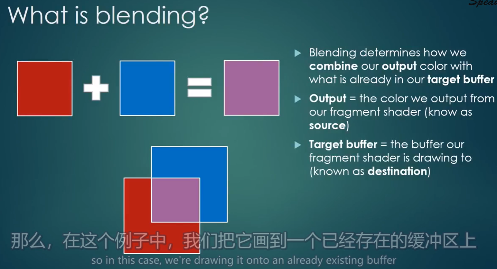
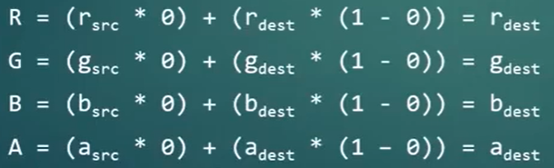
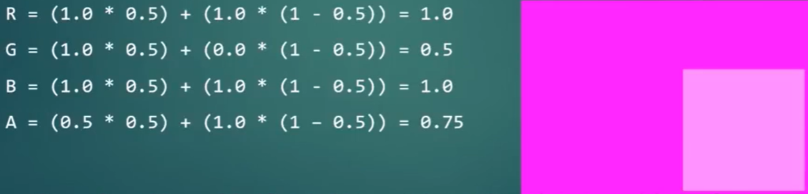

## GPU所支持的纹理个数

GPU所支持的纹理个数

1. 在Windows上，典型的现代显卡，有32个纹理插槽（textures slots）
2. 在移动设备上，比如安卓或者iPhone，可能有8个插槽，这取决于显卡、以及OpenGL的具体实现

## 垂直翻转纹理
OpenGL的纹理像素是从 **左下角** 开始的，不是在左上角

- OpenGL纹理的左下角坐标是(0, 0)
- OpenGL纹理的右上角坐标是(1, 1)

然而png图像的坐标是从 **左上角** 开始的，因此需要对png图像做垂直（上下）翻转之后，才能丢给OpenGL。

如何翻转图像

1. 可以自己手写代码，将像素调换一下位置
2. `stb_image`第三方库支持在加载图像时，垂直翻转纹：`stbi_set_flip_vertically_on_load(1);`

## 在Shader中使用纹理
### 1. 在顶点数据中添加纹理坐标

```cpp
//顶点数据
float positions[] = {
    //顶点位置xy, UV坐标xy
    -0.5f, -0.5f, 0.0f, 0.0f,  // 0
    0.5f, -0.5f, 1.0f, 0.0f,   // 1
    0.5f,  0.5f, 1.0f, 1.0f,   // 2
    -0.5f,  0.5f, 0.0f, 1.0f   // 3
};

//顶点缓冲区
VertexBuffer vb(positions, 4 * 4 * sizeof(float));
```

### 2. 读取纹理，并通过OpenGL传入GPU
```cpp
Texture texture("res/textures/ChernoLogo.png");
texture.Bind(0);                        //绑定第0个纹理槽
shader.SetUniform1i("u_Texture", 0);    //传值给着色器，将使用纹理槽的序号给u_Texture变量
```

Texture类的具体实现
```cpp
class Texture
{
private:
	unsigned int m_RendererID;
	std::string m_FilePath;
	
	unsigned char* m_LocalBuffer;	//内存当中存储纹理
	int m_Width, m_Height;
	int m_BPP;	//bits per-pixel, 每个像素的比特大小
public:
	Texture(const std::string& path);
	~Texture();

	void Bind(unsigned int slot = 0) const;
	void Unbind() const;

	inline int GetWidth() const { return m_Width; }
	inline int GetHeight() const { return m_Height; }
};
```
```cpp
#include "Texture.h"
#include "vender/stb_image/stb_image.h"

Texture::Texture(const std::string& path)
	:m_RendererID(0), m_FilePath(path), m_LocalBuffer(nullptr), m_Width(0), m_Height(0), m_BPP(0)
{
	stbi_set_flip_vertically_on_load(1); //垂直翻转纹理 
	m_LocalBuffer = stbi_load(path.c_str(), &m_Width, &m_Height, &m_BPP, 4);
		//想要使用RGBA，则传入4
	
	GLCall(glGenTextures(1, &m_RendererID));			//生成一个纹理
	GLCall(glBindTexture(GL_TEXTURE_2D, m_RendererID));	//绑定纹理

	GLCall(glTexParameteri(GL_TEXTURE_2D, GL_TEXTURE_MIN_FILTER, GL_LINEAR));	//缩小过滤器 线性重采样
	GLCall(glTexParameteri(GL_TEXTURE_2D, GL_TEXTURE_MAG_FILTER, GL_LINEAR));	//放大过滤器 线性重采样
	/*“嵌入模式”or“环绕模式”
	1. GL_CLAMP_TO_EDGE	嵌入 不希望它扩大区域
	2. 平铺
	 */
	GLCall(glTexParameteri(GL_TEXTURE_2D, GL_TEXTURE_WRAP_S, GL_CLAMP_TO_EDGE));	//水平环绕(S相当于X) 
	GLCall(glTexParameteri(GL_TEXTURE_2D, GL_TEXTURE_WRAP_T, GL_CLAMP_TO_EDGE));	//垂直环绕(T相当于Y)
	//注：如果不设置这四个参数，会得到一个黑色的纹理。因为它们没有默认值

	//将数据拷贝到GPU上
	GLCall(glTexImage2D(
		GL_TEXTURE_2D,		//纹理类型
		0,					//level=0，表示它不是一个复合纹理
		GL_RGBA8,			//你希望OpenGL在GPU中如何存储你的纹理 => 按照RGBA8来存储
		m_Width, m_Height,	//宽高
		0,					//像素边框=0
		GL_RGBA,			//传给GPU数据的格式是什么 => RGBA四个通道
		GL_UNSIGNED_BYTE,	//传给GPU数据的类型 => 每个通道是一个unsigned byte
		m_LocalBuffer		//数据（也可以传nullptr，这表示先分配显存，到后面再拷贝）
	)); 
	GLCall(glBindTexture(GL_TEXTURE_2D, 0)); //解除绑定

	if (m_LocalBuffer) 
	{
		stbi_image_free(m_LocalBuffer); //删除内存中的数据
		m_LocalBuffer = nullptr;
	}
}

Texture::~Texture()
{
	GLCall(glDeleteTextures(1, &m_RendererID));

	if (m_LocalBuffer)
	{
		stbi_image_free(m_LocalBuffer); //删除内存中的数据
		m_LocalBuffer = nullptr;
	}
}

void Texture::Bind(unsigned int slot) const
{
	//激活第slot个纹理槽（这意味着下一个纹理将绑定到第slot个纹理槽上）
	GLCall(glActiveTexture(GL_TEXTURE0 + slot));
	//将m_RendererID纹理，绑定到激活的槽里（也就是第slot个纹理槽中）
	GLCall(glBindTexture(GL_TEXTURE_2D, m_RendererID));

	//注：虽然纹理槽范围是[GL_TEXTURE0, GL_TEXTURE31]，但不一定你的显卡支持，这还是取决于你的显卡
	//	  有32个，是因为32是OpenGL规格允许的最大值
}

void Texture::Unbind() const
{
	GLCall(glBindTexture(GL_TEXTURE_2D, 0));
}
```

### 3. 在Shader中使用纹理

```glsl
#shader vertex
#version 330 core

//顶点数据
layout(location = 0)in vec4 position;	//顶点位置（注意，这里是vec4）
layout(location = 1)in vec2 texCoord;	//UV坐标

out vec2 v_TexCoord; //输出变量。顶点着色器的输出，将会作为片元着色器的输入

void main()
{
	gl_Position = position;
	v_TexCoord = texCoord;
};

#shader fragment
#version 330 core

layout(location = 0)out vec4 color;

in vec2 v_TexCoord;	//由顶点着色器传入

uniform sampler2D u_Texture;
	//sampler2D为二维的纹理图
	//OpenGL只需设置纹理槽的Id即可，sampler2D即会取到对应的纹理

void main()
{
	vec4 texColor = texture(u_Texture, v_TexCoord);	//对指定纹理坐标进行采样
	color = texColor;
};
```

### 4. 添加纹理混合

```cpp
//# 定义OpenGL如何混合alpha像素
GLCall(glEnable(GL_BLEND)); //启用混合
GLCall(glBlendFunc(GL_SRC_ALPHA, GL_ONE_MINUS_SRC_ALPHA));  //RGBA = SrcRgba * GL_SRC_ALPHA + DestRgba * GL_ONE_MINUS_SRC_ALPHA
```

## 纹理混合

### 引言
在图形学中，不可避免要渲染一些部分或完全透明的东西，例如

1. 有色玻璃：只能透过某种颜色
2. 具有透明通道的图片：透明的像素不渲染

默认情况下，OpenGL不执行任何混合，会将图片渲染成不透明的东西。

1. 如左图，如果你没有告诉OpenGL **处理透明度的策略** ，那么它渲染的结果将不会是你想要的
2. 右图就正确设置了处理透明度的策略，结果是正确的


### 什么是混合？

例如，在同一个位置上有两块有色玻璃，一个是红色，一个是蓝色，蓝色玻璃压在红色玻璃上面

1. 因为蓝色压盖在红色玻璃上面，因此渲染顺序是：先红色玻璃，再蓝色玻璃
2. 首先，先渲染红色玻璃，渲染结果肯定是红色。然后将其存储在目标缓冲区(Target buffer)当中。在混合的语境中，之前渲染的旧颜色值一般称为destination（目标）
3. 其次，渲染蓝色玻璃，渲染结果肯定是蓝色，此时就遇到了如何与原先颜色（红色）混合的问题。在混合的语境中，当前渲染的颜色值被称为source（源），或输出颜色。



因此，混合决定了如何将 **输出颜色(output)** 与 **之前的颜色(target buffer)** 进行结合。

### 启用混合
默认是禁用

1. `glEnable(GL_BLEND)`
2. `glEnable(GL_BLEND)`

### 混合色计算方式

指定混合色计算方式的API：`glBlendFunc(src_factor, dest_factor)`

其对应的计算公式：`两个颜色的混合结果 = src * src_factor + dest * dest_factor`

- `src_factor`：source的因子，默认为`GL_ONE`
- `dest_factor`：dest的因子，默认为`GL_ZERO`

事实上，src_factor、dest_factor的因子也可以只作用于RGB、RGBA、R、G、B、RG等等。

例：`glBlendFunc(GL_ONE, GL_ZERO)`

1. `GL_ONE`：取颜色的RGBA的通道，然后`×1`
2. `GL_ZERO`：取颜色的RGBA的通道，然后`×0`
3. 因此，计算公式为`result = src * 1 + dest * 0`
4. 事实上，计算结果是新的渲染结果，它会把旧的渲染结果进行覆盖

### 混合模式
指定混合的模式：`glBlendEquation(mode)`

- `mode`：如何组织src和dest的颜色，也就是上面公式中的运算符，默认是`GL_FUNC_ADD`，也就是`+`号

### 混色示例

一、alpha=0，则保留dest的颜色

1. `src_factor  = GL_SRC_ALPHA`
2. `dest_factor = GL_ONE_MINUS_SRC_ALPHA`
3. `mode        = GL_FUNC_ADD`



二、部分透明

- `src  = (1.0, 1.0, 1.0, 0.5)` 白色玻璃，但透明度0.5
- `dest = (1.0, 0.0, 1.0, 1.0)` 洋红色长方形



